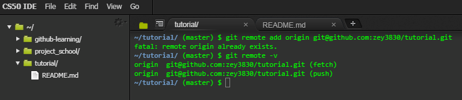

# GitHub Tutorial (2019)

*by Ze Zhen Yang*

---
# <a href="commands.md">Commands</a>
(Clicking Commands will direct you to a list of commands and phase mentioned in the directions with its explanation)

## Git vs. GitHub
- Git is independent from github that is use for version controls and create repositories
- Github depedents on git, it is a website that lets you better manage your repositories


---
## Initial Setup
- To set up a github account (if you don't have one), go [here](https://github.com/join?source=header-home). 
- Setting up IDE (on ide.cs50.io), go [here](https://github.com/hstatsep/ide50).
    - Just follow the direction about generating and connecting a SSH key between IDE and github to setup the IDE. 
    - It is always important to connect a SSH key when setting up a new IDE with github because this way you won't have to login everytime you want to use the IDE.
        - A SSH key is like a ID card, by providing the key to the IDE it allows you to access your repository as long as you are login on github.

---
## Repository Setup
1. Go into your IDE, create a directory using "mkdir" then use "cd" to move into that directory  
```mkdir tutorial```  
```cd tutorial```
2. In the new directory do "git init" to setup git commands

3. Create a new file using "touch" (name the file "README.md")  
```touch README.md```

4. Open up the file by using "c9" (for ide.cs50.io & some other IDE) or just open it up manually and type something on it (remember to save the edited file)  
```c9 README.md```

5. Go back to the command terminal and do "git status" to check the whatever the new file have been changed or edited

6. After you made sure there are changes in the file (if not add something to the file) do "git add" to add the file to the staging step
```git add README.md```

7. Then do another "git status", you should see that the file have been added

8. After checking it has been added, you can do "git commit" with a message to save it to the local repository


9. Now go onto github and login to your account

10. In the home screen (can be reached by clicking on the octocat on the top left corner) click the green button with "New" written on it


11. Now in the box under "Repository name", enter the directory name on the IDE exactly as it is

12. After that you can select whatever you want it public or private and you don't need to check the "Initialize this repository with a README" box since you already created a "README.md" file and click the green button that says "Create repository"


13. Now you should be relocated into another screen that says "Quick setup", in the first box select SSH instead of HTTPS


14. On the third box, you should see 2 git commands "git remote" and "git push", copy and paste the "git remote" command (everything with the SSH) on the IDE


15. In the IDE do "git remote -v", this will tell you that your local repository (IDE) is connected to the remote repository (github), if there is nothing then that means there are no connection so you should check if you skip a step


(Since I already have the remote setup it gives an error, otherwise it will show nothing)

16. After checking go back to the github page and copy the second command, "git push -u origin master", onto your IDE. What this do is that it tells your IDE where to push which allows you to just use "git push" without other argument/addons


17. Now go back to github and refresh the page, you should see a new screen with your READme.md file

