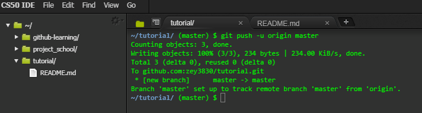

# GitHub Tutorial (2019)

*by Ze Zhen Yang*

---
# <a href="commands.md">Commands</a>
---
## Git vs. GitHub
- Git is independent from github that is use for version controls and create repositories
- Github depedents on git, it is a website that lets you better manage your repositories

---
## Initial Setup
- To set up a github account (if you don't have one), go [here](https://github.com/join?source=header-home). 
- Setting up IDE (on ide.cs50.io), go [here](https://github.com/hstatsep/ide50).
    - Just follow the direction about generating and connecting a SSH key between IDE and github to setup the IDE. 
    - It is always important to connect a SSH key when setting up a new IDE with github because this way you won't have to login everytime you want to use the IDE.
        - A SSH key is like a ID card, by providing the key to the IDE it allows you to access your repository as long as you are login on github.

---
## Repository Setup
1. Go into your IDE, create a directory using "mkdir" then use "cd" to move into that directory 

2. In the new directory do "git init" to setup git commands

3. Create a new file using "touch" (name the file "README.md")

4. Open up the file by using "c9" (for ide.cs50.io & some other IDE) or just open it up manually and type something on it (remember to save the edited file)

5. Go back to the command terminal and do "git status" to check the whatever the new file have been changed or edited

6. After you made sure there are changes in the file (if not add something to the file) do "git add" to add the file to the staging step

7. Then do another "git status", you should see that the file have been added

8. After checking it has been added, you can do "git commit" with a message to save it to the local repository

9. Now go onto github and login to your account

10. In the home screen (can be reached by clicking on the octocat on the top left corner) click the green button with "New" written on it

11. Now in the box under "Repository name", enter the directory name on the IDE exactly as it is

12. After that you can select whatever you want it public or private and you don't need to check the "Initialize this repository with a README" box since you already created a "README.md" file and click the green button that says "Create repository"

13. Now you should be relocated into another screen that says "Quick setup", in the first box select SSH instead of HTTPS

14. On the third box, you should see 2 git commands "git remote" and "git push", copy and paste the "git remote" command (everything with the SSH) on the IDE

15. In the IDE do "git remote -v", this will tell you that your local repository (IDE) is connected to the remote repository (github), if there is nothing then that means there are no connection so you should check if you skip a step

(Since I already have the remote setup it gives an error, otherwise it will show nothing)

16. After checking go back to the github page and copy the second command, "git push -u origin master", onto your IDE. What this do is that it tells your IDE where to push which allows you to just use "git push" without other argument/addons

17. Now go back to github and refresh the page, you should see a new screen with your READme.md file

---
## Workflow & Commands
- git status
    - pretty much just show the files that has been edited or changed
- git add
    -  put the file(s) onto the staging step
        - the staging step is the step before being commited, to ensure that you want to commit this file
    - git add filename
        - adds a single file, can add more when a space (git add filename filename)
    - git add .
        - adds every files in the **CURRENT** directory
    - git add -A
        - similar to "git add .", but **ADDS EVERYTHING** (files & directory) outside and inside the current directory
- git commit
    - saves changes or staged files to the local repository (the IDE you are using right now)
    - git commit -m "message"
        - git commit is usually used with -m to stand for message, where you give the commit a name so it will be easier to look for if you every go back
        - when naming, it will help by using present tense, lower case, and the main change of the file
- git push
    - upload or saves the commit file to a remote repository (in this case it will be github)
    - to use "git push" you will have to set it up using "git push -u origin master"

---
## Rolling Back Changes
- Undo edit on a file
    - You changed a file then sudden you want to undo all your changes, but don't know what you change use "git checkout -- filename"
        - "git checkout -- filename" will remove all change made after pervious saving, in other words this command will restore your file to its pervious save
- Remove file from stage
    - If you want to unstage a file you can do "git reset HEAD filename"
        - "git reset HEAD~1" will also unstage the file as well as commit
- Undo commit
    - If you want to uncommit you can do "git reset --soft HEAD~1"
    - If you want to restore the file to its pervious version and uncommit it, you will use "does git reset --hard HEAD~1"
        - To uncommit and unstage at the same time you can do "git reset HEAD~1"
- Undo push
    - To undo a commit that has been pushed onto a remote repository you will have to use "git revert" commands
        - "git revert HEAD" will undo your current commit and use the pervious one
        - "git revert SHA" (SHA is the 40 character code next to "commit" when you do "git log") will undo your current commit and use the selected commit