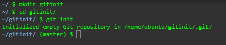
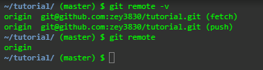
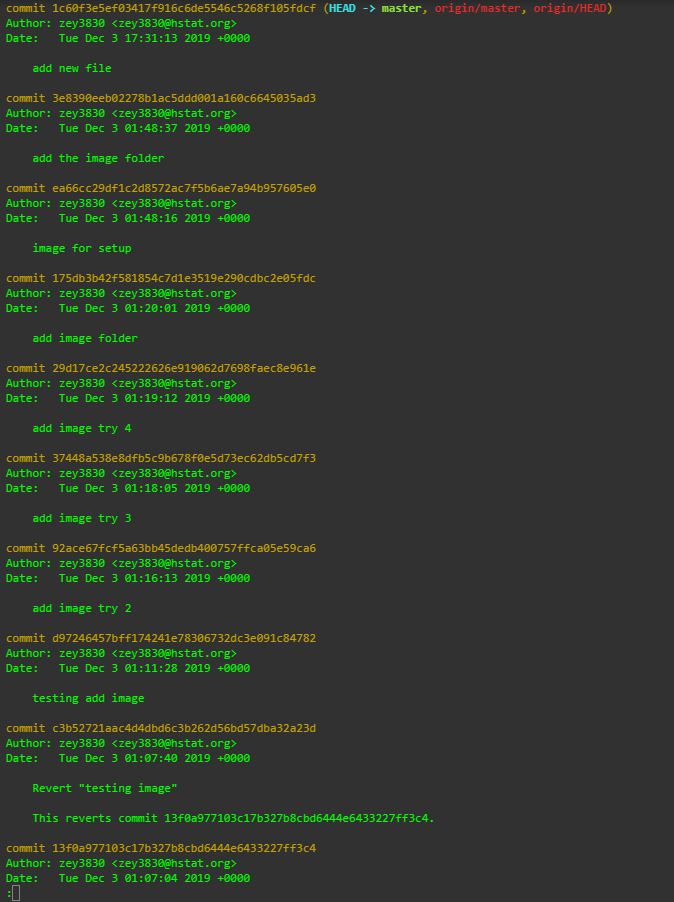
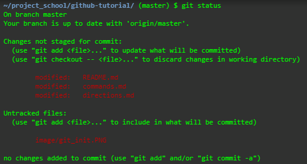
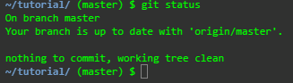

## Commands

**Repository**
- Reposiotry or repo is a like a digital storage where you store your folders and files as well as other versions of the files

**IDE**
- Short for Integrated development environment, simply put it is a place to code

**Commandline**
- Commandline is a way to interact with the folders and files on the computer or repostiory with a termial (a place to code) or IDE

**Directory**
- Directory pretty much means folder
    - For example, "current directory" means the current folder you are in right now

**mkdir**
- "mkdir" is a command in commandline to create directory
    - Usage
        - "mkdir firstfolder", this will create a single directory
        - "mkdir folder1 folder2", this will create 2 directory
            - you can create multiple directory by spacing it from the pervious one (ex. "mkdir folder1 folder2 folder3 so-on")

**touch**
- "touch" like "mkdir", is a commandline command, but creates file
    - it follows the same idea as "mkdir", "touch file1" or "touch file1 file2 so-on"

**c9**
- In some IDE supported by cloud9 IDE can use "c9" to access file
    - To open a file just do, "c9 filename"

**cd**
- "cd" is a commandline command that allows you to navigate around the directories
    - "cd directoryname", moves into that directory
        - "cd firstlocation/second/third", by using a slash (/) you will be able to move into directories within other directories
    - "cd .."(it should be 2 dots instead of 3), moves back to the pervious directory
    - "cd ~", goes back to the root/first directory
        - By using "cd ~" you can link it up so that you will be able to move back more than 1 folder
            - "cd ~/folder1/folder2/so-on"

**git init**
- "git init" is a command that you have always do before using commands from git because it setup or initialize git
    - To use "git init" you will have to move into the directory that you want to have git (not outside)
    - After using "git init" you should see "master"
    
    

**git remote -v**
- "git remote -v" is a command to check whatever you have a connection with your local repo and remote repo
    - Always remember to include "-v" because it shows the connection in more detail, if you just do "git remote" you will only see the name of where it is connected to, but not in more detail like below

**git remote add origin git@github.com:example.git**
- What this does is that it will add the remote repo (git@github.com:example.git) to your local repo
    - "origin" is just a nickname, so you can actually just name it anything you want, but in most case origin will make things simpler

**git push -u origin master**
- What this does is telling your local repo that if you do "git push" you will push onto "origin", the connection that you setup by using "git remote add"
    - So after you typed this command, you can just use "git push" to store your commit to github without any other step

**The 4 git part**
- Working Directory
    - Simply, it's where you do all the work
    - If I am editing a file, then I am in the first part, working directory
- Staging Area
    - When you use "git add" to prepare those changes that you made to the repo during the working directory to be committed
- Repository
    - This is where you use "git commit", using this command it will save the files in the staging area as a version of the repo
    - You can then use "git push" to store this commmit onto the remote repo
    - Everything you commit, the commit will be saved so you can go back later
    
    
    (The image above is "git log")

---
## Workflow
**git status**
- "git status" is a very useful command in github, it tells you whatever your file have been changed or whatever it's on stage
    - If the file is green it means it have been added on to the stage
    - If the file is red it means it have been changed, but not added to stage
    
    

    - If "git status" tells you that "nothing to commit", it means that no change has been added and everything is up to date
    
    
    

**git add**
-  Pretty much just put the file(s) onto the staging area
    - "git add filename"
        - adds a single file, can add more when a space ("git add filename filename so-on")
    - "git add ."
        - adds every files in the **CURRENT** directory
    - "git add -A"
        - similar to "git add .", but **ADDS EVERYTHING** (files & directory) outside and inside the current directory

**git commit**
- saves changes or staged files to the local repo
- "git commit -m "message""
    - git commit is usually used with -m to stand for message, where you give the commit a name so it will be easier to look for if you every go back
    - When naming, it will help by using present tense, lower case, and the main change of the file

**git push**
- "git push", upload or saves the commit file to a remote repo (in this case it will be github)
    - To use "git push" you will have to set it up using "git push -u origin master" as mentioned before

---
## Rolling Back Changes
**Undo edit on a file**
- You changed a file then sudden you want to undo all your changes, but don't know what you change use "git checkout -- filename"
    - "git checkout -- filename" will remove all change made after pervious saving, in other words this command will restore your file to its pervious save
    

**Remove file from stage**
- If you want to unstage a file you can do "git reset HEAD filename"
    - "git reset HEAD~1" will also unstage the file as well as commit
    

**Undo commit**
- If you want to uncommit you can do "git reset --soft HEAD~1"
- If you want to restore the file to its pervious version and uncommit it, you will use "does git reset --hard HEAD~1"
    - To uncommit and unstage at the same time you can do "git reset HEAD~1"
    

**Undo push**
- To undo a commit that has been pushed onto a remote repository you will have to use "git revert" commands
    - "git revert HEAD" will undo your current commit and use the pervious one
    - "git revert SHA" (SHA is the 40 character code next to "commit" when you do "git log") will undo your current commit and use the selected commit

**HEAD & HEAD~**
- "git revert **HEAD**", "HEAD" means commit
    - Having "HEAD" itself means the most recent commit (for example, the file you just committed will be the HEAD)
- "git reset **HEAD~1**", means the pervious commit
    - So if you use "HEAD~2", it will mean the second commit before your current commit 
        - Same as "HEAD~3", it will be your third pervious commit
    - To check your commits, do "git log", it will show all your pervious commits and to exit just press "q" on the keyboard